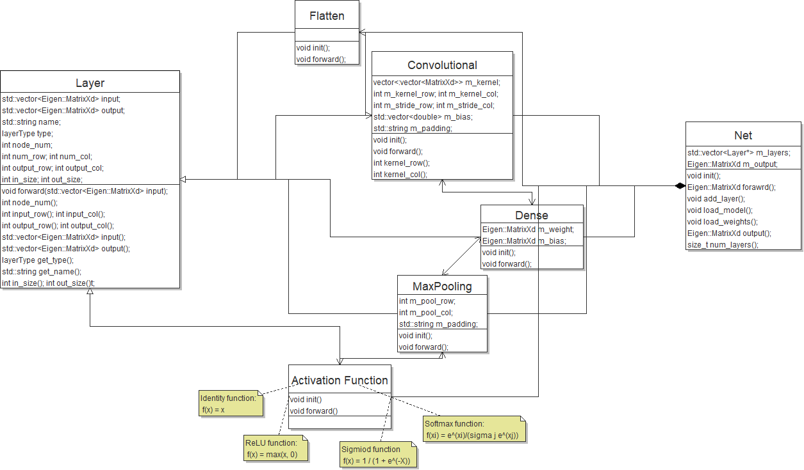

# cs133-project


**Generic implementation of a neural network**

-----

## Introduction

This project is a C++ header only library that can load a pre-trained network definition file and perform forward propagation with given input.



## Quick Start


***model.json*** and ***weights.json*** are pretrained network definition file. ****.png"*** are 28×28 MNIST images.


```C++
#include "../include/Net.hpp"
#include <iostream>
#include <string>
#include <fstream>
#include <Eigen/Core>
#include <pybind11/embed.h>
#include <pybind11/pybind11.h>

using namespace std;
namespace py = pybind11;
using namespace py::literals;

Eigen::MatrixXd convert(string);

int main(){
  py::scoped_interpreter guard{};
  // file path
  string model_path("model.json");
  string weights_path("weights.json");

  vector<string> input_path;
  
  input_path.push_back("0.png");
  input_path.push_back("1.png");
  input_path.push_back("2.png");
  input_path.push_back("3.png");
  input_path.push_back("4.png");
  input_path.push_back("5.png");
  input_path.push_back("6.png");
  input_path.push_back("7.png");
  input_path.push_back("8.png");
  input_path.push_back("9.png");

  for (auto it = input_path.begin(); it != input_path.end(); ++it) {
    // LeNet-5
    Net net;
    net.init(model_path, weights_path);

    Eigen::MatrixXd input = convert(*it);

    Eigen::MatrixXd output = net.forward(input);
    int result;
    double err = 10;
    for (int i = 0; i < 10; ++i) {
      if ( abs(output(i, 0) - 1) < err ) {
          err = abs(output(i, 0) - 1);
          result = i;
      }
    }
    cout << "The number in the picture is " << result << endl;
  }

  return 0;
}

```

function *convert()* takes a **image file path** as input and returns an **Eigen Matrix** which represents the image.

```C++
Eigen::MatrixXd
convert(string filename){
  auto locals = py::dict("filename"_a = filename);
  py::exec(R"(
    from PIL import Image
    import numpy as np
    im = Image.open(filename)
    im = im.convert('L')
    width,height = im.size
    data = list(im.getdata())

    file = open(filename.split('.')[0] + '.txt','w')
    for i in range(height):
      for j in range(width):
        file.write(str(data[i*width + j]))
        file.write(' ')
      file.write('\n')
    file.close()
    name = filename.split('.')[0] + '.txt'
  )", py::globals(), locals);
  
  std::string name = locals["name"].cast<std::string>();
  int height = locals["height"].cast<int>();
  int width = locals["width"].cast<int>();

  Eigen::MatrixXd mat(height, width);

  ifstream fin(name);
  for(int i = 0;i < height;++i){
    for(int j = 0;j < width;++j){
      double buffer;
      fin>>buffer;
      mat(i,j) = buffer / 255.0;
    }
  }
  return mat;
}


```

**Run demo.cpp**

     cd demo && make clean && make && ./demo


## Supported networks

+ **layers**
  - fully connected (Dense)
  - convolution
  - maxpooling
  - flatten
+ **activation functions**
  - softmax
  - sigmoid
  - relu
  - identity

## Dependencies

- *Eigen*
- *Rapidjson*
- *pybind11* : needed in demo.cpp

## Platforms

Linux

## Document

**doc/latex** and **doc/html** contains the document generated by Doxygen, including all the class APIs.
